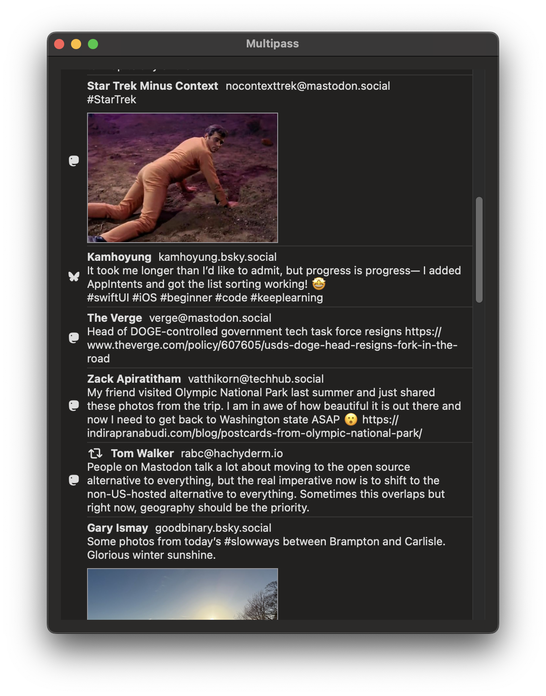
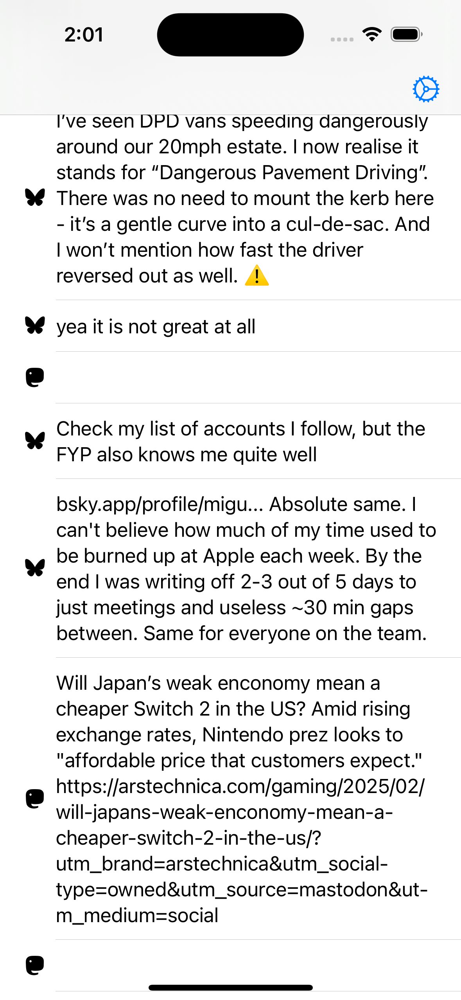

# Multipass
Yes she knows it's a multipass

Multipass can merge Bluesky and Mastodon feeds into a unified timeline. It should support macOS and iOS.

> [!WARNING]
> This app is juuust barely functional. I just cannot stress enough what a poor state this is currently in.

  

  

## Usage

You can add and remove accounts and they will be persisted in the Keychain. You do this from settings.

### Building

**Note**: requires Xcode 16 and I may have broken the iOS builds...

- clone the repo
- `cp User.xcconfig.template User.xcconfig`
- update `User.xcconfig` with your personal information
- build/run with Xcode

## Acknowledgements 

This project uses symbols from [social-symbols](https://github.com/jeremieb/social-symbols). It rocks.

## Contributing and Collaboration

I would love to hear from you! Issues or pull requests work great. Both a [Matrix space][matrix] and [Discord][discord] are available for live help, but I have a strong bias towards answering in the form of documentation. You can also find me [here](https://www.massicotte.org/about).

I prefer collaboration, and would love to find ways to work together if you have a similar project.

I prefer indentation with tabs for improved accessibility. But, I'd rather you use the system you want and make a PR than hesitate because of whitespace.

By participating in this project you agree to abide by the [Contributor Code of Conduct](CODE_OF_CONDUCT.md).

[matrix]: https://matrix.to/#/%23chimehq%3Amatrix.org
[matrix badge]: https://img.shields.io/matrix/chimehq%3Amatrix.org?label=Matrix
[discord]: https://discord.gg/esFpX6sErJ
